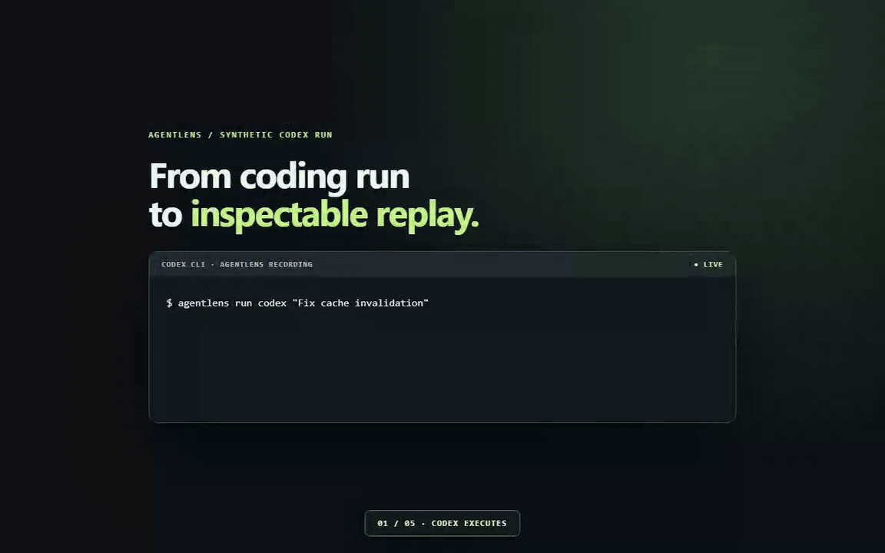
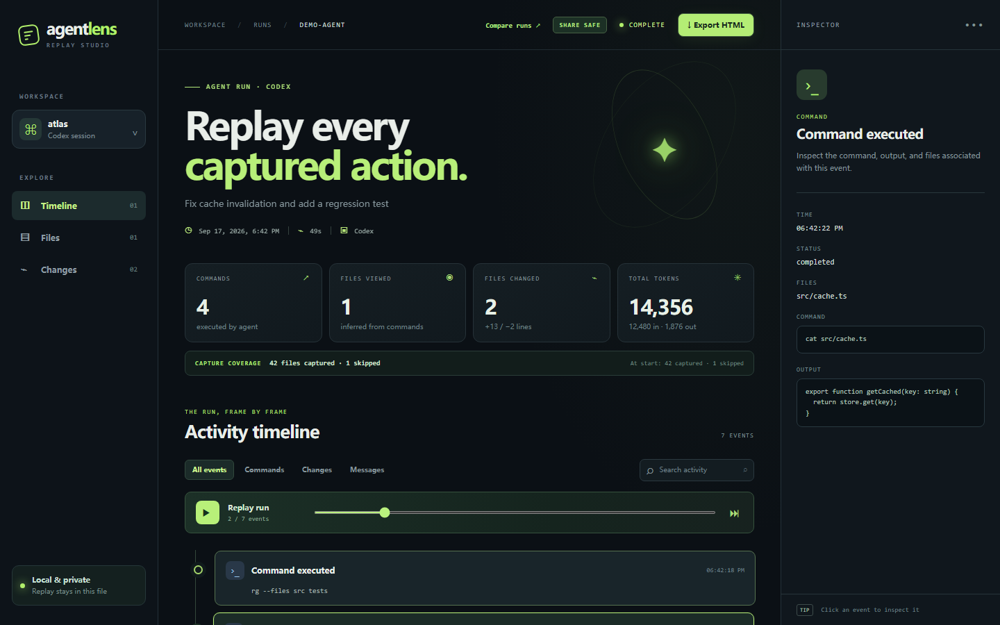
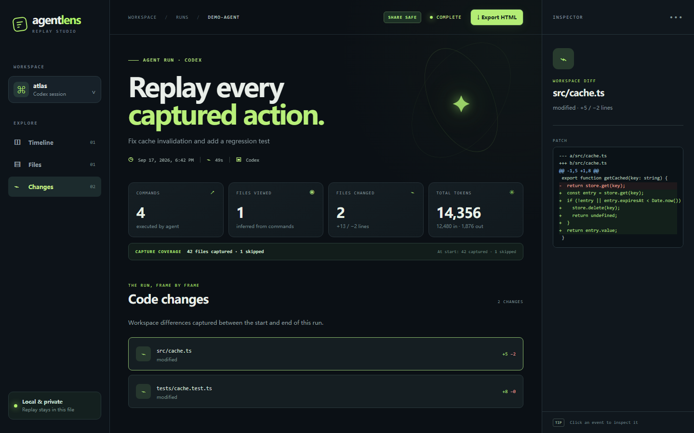
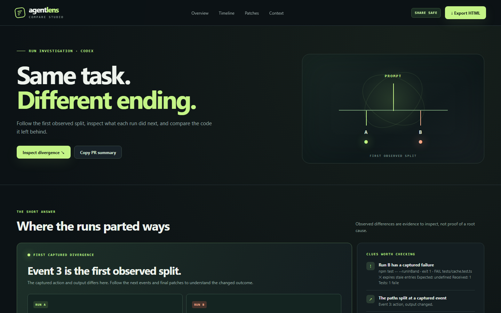

# AgentLens Replay

**A replay button for AI coding agents.** See what Codex likely read, ran, and changed, then compare two runs to find where they diverged. Export a redacted, standalone HTML artifact for a PR or teammate.



*Six-second synthetic walkthrough: Codex runs → timeline appears → inspect command output → review the diff → export share-safe HTML.*

[Replay demo](https://fang520huang-lgtm.github.io/AgentLens/) · [Run A vs Run B demo](https://fang520huang-lgtm.github.io/AgentLens/compare.html) · [Static screenshots](#replay-screenshots) · [Session schema](docs/session-schema.md) · [中文说明](#中文说明)

## Quick start

Requires **Node.js 20+**, Git, and an installed, authenticated [Codex CLI](https://developers.openai.com/codex/noninteractive).

```bash
npm install -g github:fang520huang-lgtm/AgentLens
agentlens run codex "Find and fix the failing test"
```

Run the second command in a Git project. AgentLens opens the local replay when Codex finishes in an interactive terminal. The recording lives in `.agentlens/runs/<id>/`; the default Codex sandbox is `workspace-write`.

```bash
agentlens run codex --cwd /path/to/project --sandbox read-only -- "Explain the architecture"
agentlens replay .agentlens/runs/<id>
agentlens export .agentlens/runs/<id> --out agent-run.html
agentlens compare .agentlens/runs/run-a .agentlens/runs/run-b
```

## Replay screenshots

**Timeline overview**


**Inspect a command and its output**



**Review the code changes**



## Run A vs Run B

**Why did the same prompt succeed yesterday and fail today?** `agentlens compare` creates a standalone page that puts both runs side by side. It highlights the first captured divergence, the first failing command, commands and likely file views unique to each run, patch differences, token usage, and changes in prompt, model, Git state, or sandbox. Click a timeline row or file to inspect both sides. Copy a short summary into a PR.



[Side-by-side timeline](docs/screenshots/compare-timeline.png) · [Patch comparison](docs/screenshots/compare-patches.png) · [Mobile view](docs/screenshots/compare-mobile.png) · [Open live demo](https://fang520huang-lgtm.github.io/AgentLens/compare.html)

The page is **redacted by default** and opens automatically in an interactive terminal. It is saved as `comparison.html` beside Run B's `session.json`. The page's **Export HTML** button downloads a share-safe copy, including when the local page was generated with `--raw`.

```bash
agentlens compare .agentlens/runs/run-a .agentlens/runs/run-b --out comparison.html
agentlens compare .agentlens/runs/run-a .agentlens/runs/run-b --text  # original details in terminal
agentlens compare .agentlens/runs/run-a .agentlens/runs/run-b --json  # original details for automation
agentlens compare .agentlens/runs/run-a .agentlens/runs/run-b --raw --no-open
```

The first divergence includes command exit codes and outputs, so two runs that execute the same command but get different results still show a split. It describes captured evidence, not a proven cause. Redaction may mask sensitive differences; use `--raw` locally when needed, and review the page before sharing it.

## A shareable artifact, with a clear boundary

The local `session.json` and `index.html` preserve original commands, outputs, and code for debugging. **`agentlens export` redacts by default**; the replay's **Export HTML** button downloads the same redacted standalone page. The page labels itself `SHARE SAFE` or `RAW`.

```bash
agentlens export .agentlens/runs/<id> --redact --out pr-replay.html  # explicit default
agentlens export .agentlens/runs/<id> --raw --out private-replay.html  # original data
```

Redaction covers common API tokens, authorization headers, private keys, secret assignments, `.env` patches and command output, home paths, and usernames. It is pattern based and cannot guarantee every secret is caught. **Review the exported HTML before sharing it.** The recording directory should be added to your project's `.gitignore`.

## Inspect, recover, compare

- **Timeline:** captured commands, messages, file changes, tool calls, errors, and playback.
- **Inspector:** command output, status, referenced files, and workspace patches.
- **Coverage:** files captured and skipped at run start and end. Files viewed are inferred from read/search commands; this is not a complete file access log.
- **Recovery:** `agentlens recover <run-directory>` rebuilds `session.json` and HTML from a surviving `events.jsonl`. A recovered run may have no patch if the final snapshot was not taken.
- **Comparison:** `agentlens compare run-a run-b` opens the Run A vs Run B page. Use `--text` for the terminal report or `--json` for automation.

```bash
agentlens recover .agentlens/runs/<id>
agentlens compare .agentlens/runs/run-a .agentlens/runs/run-b --json
```

## How it works

AgentLens wraps the official [Codex JSONL event stream](https://developers.openai.com/codex/noninteractive) and captures the workspace before and after the run. It compares Git tracked and unignored text files to produce patches. Snapshots are limited to **1 MB per file, 40 MB total, and 4,000 files**; binary files are counted as skipped, while common build directories are filtered out before coverage is counted. The UI reports capture coverage and reasons for skipped candidate files.

The versioned [session artifact](docs/session-schema.md) records agent and tool versions, model when explicitly chosen, sandbox, platform, Git state, token usage, coverage, timeline, and changes. Raw timestamped Codex events remain in `events.jsonl`. The replay uses plain HTML, CSS, JavaScript, and embedded JSON; it works offline and has no runtime npm dependencies.

## Development

```bash
npm test
npm run demo
```

CI runs the same synthetic JSONL fixture and export checks on Ubuntu, macOS, and Windows. The [replay demo](https://fang520huang-lgtm.github.io/AgentLens/) and [comparison demo](https://fang520huang-lgtm.github.io/AgentLens/compare.html) use synthetic sample runs. AgentLens records Codex only; it does not run its own agent model.

To refresh the README visuals, run `npm run demo`, then `python scripts/capture-demo.py` for static screenshots and `python scripts/capture-walkthrough.py` for the GIF. The latter needs Playwright, Chrome, and ffmpeg or `imageio-ffmpeg`.

## 中文说明

在 Git 项目里运行 `agentlens run codex "任务"`，即可得到本地时间线。`agentlens compare <运行 A> <运行 B>` 会生成左右并排的对比页面，标出首次可观察分叉、失败命令和代码差异；默认脱敏。`agentlens export <运行目录> --out replay.html` 也默认导出脱敏的单文件页面；`--raw` 才包含原始内容。录制中断后可以用 `agentlens recover <运行目录>` 重建回放。文件读取是根据命令推断的，分享前仍请检查导出内容。

## License

MIT
