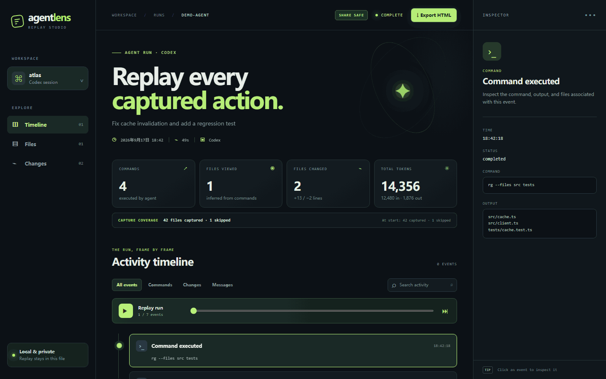

# AgentLens Replay

**A replay button for AI coding agents.** See what Codex likely read, ran, and changed, with token usage and capture coverage in one local timeline. Export a redacted, standalone HTML artifact for a PR or teammate.



[Live demo](https://fang520huang-lgtm.github.io/AgentLens/) · [Session schema](docs/session-schema.md) · [中文说明](#中文说明)

## Quick start

Requires **Node.js 20+**, Git, and an installed, authenticated [Codex CLI](https://developers.openai.com/codex/noninteractive).

```bash
npm install -g github:fang520huang-lgtm/AgentLens
agentlens run codex "Find and fix the failing test"
```

Run the second command in a Git project. AgentLens opens the local replay when Codex finishes in an interactive terminal. The recording lives in `.agentlens/runs/<id>/`; the default Codex sandbox is `workspace-write`.

```bash
agentlens run codex --cwd /path/to/project --sandbox read-only -- "Explain the architecture"
agentlens replay .agentlens/runs/<id>
agentlens export .agentlens/runs/<id> --out agent-run.html
agentlens compare .agentlens/runs/run-a .agentlens/runs/run-b
```

## A shareable artifact, with a clear boundary

The local `session.json` and `index.html` preserve original commands, outputs, and code for debugging. **`agentlens export` redacts by default**; the replay's **Export HTML** button downloads the same redacted standalone page. The page labels itself `SHARE SAFE` or `RAW`.

```bash
agentlens export .agentlens/runs/<id> --redact --out pr-replay.html  # explicit default
agentlens export .agentlens/runs/<id> --raw --out private-replay.html  # original data
```

Redaction covers common API tokens, authorization headers, private keys, secret assignments, `.env` patches and command output, home paths, and usernames. It is pattern based and cannot guarantee every secret is caught. **Review the exported HTML before sharing it.** The recording directory should be added to your project's `.gitignore`.

## Inspect, recover, compare

- **Timeline:** captured commands, messages, file changes, tool calls, errors, and playback.
- **Inspector:** command output, status, referenced files, and workspace patches.
- **Coverage:** files captured and skipped at run start and end. Files viewed are inferred from read/search commands; this is not a complete file access log.
- **Recovery:** `agentlens recover <run-directory>` rebuilds `session.json` and HTML from a surviving `events.jsonl`. A recovered run may have no patch if the final snapshot was not taken.
- **Comparison:** `agentlens compare run-a run-b` shows the first differing captured event, extra commands, unique file views, patch differences, and token delta. Add `--json` for automation.

```bash
agentlens recover .agentlens/runs/<id>
agentlens compare .agentlens/runs/run-a .agentlens/runs/run-b --json
```

## How it works

AgentLens wraps the official [Codex JSONL event stream](https://developers.openai.com/codex/noninteractive) and captures the workspace before and after the run. It compares Git tracked and unignored text files to produce patches. Snapshots are limited to **1 MB per file, 40 MB total, and 4,000 files**; binary files are counted as skipped, while common build directories are filtered out before coverage is counted. The UI reports capture coverage and reasons for skipped candidate files.

The versioned [session artifact](docs/session-schema.md) records agent and tool versions, model when explicitly chosen, sandbox, platform, Git state, token usage, coverage, timeline, and changes. Raw timestamped Codex events remain in `events.jsonl`. The replay uses plain HTML, CSS, JavaScript, and embedded JSON; it works offline and has no runtime npm dependencies.

## Development

```bash
npm test
npm run demo
```

CI runs the same synthetic JSONL fixture and export checks on Ubuntu, macOS, and Windows. The [public demo](https://fang520huang-lgtm.github.io/AgentLens/) uses a synthetic sample run. AgentLens records Codex only; it does not run its own agent model.

## 中文说明

在 Git 项目里运行 `agentlens run codex "任务"`，即可得到本地时间线。`agentlens export <运行目录> --out replay.html` 默认导出脱敏的单文件页面；`--raw` 才导出原始内容。录制中断后可以用 `agentlens recover <运行目录>` 重建回放，也可以用 `agentlens compare <运行 A> <运行 B>` 比较两次执行。文件读取是根据命令推断的，分享前仍请检查导出内容。

## License

MIT
